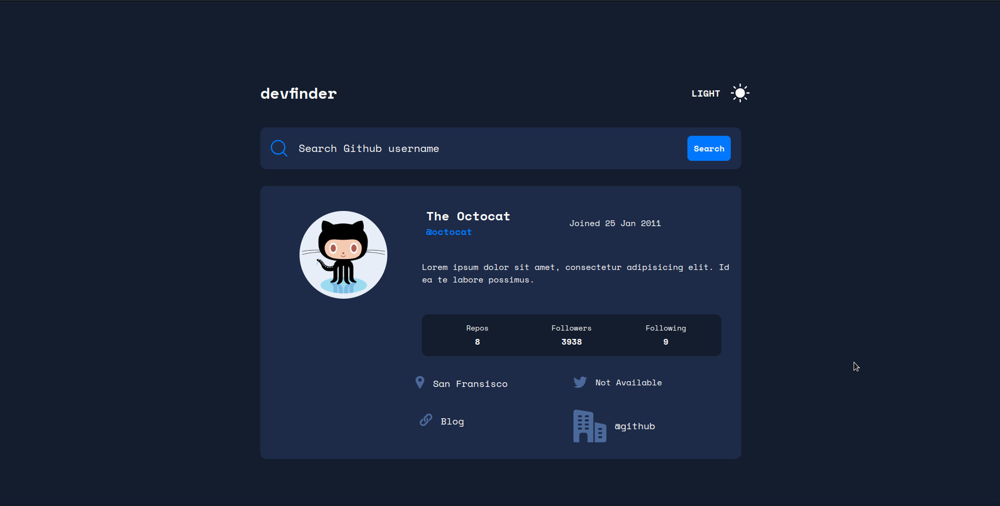

# GitHub user search app solution

## Table of contents

- [Overview](#overview)
- [The challenge](#the-challenge)
- [Screenshot](#screenshot)
- [Built With](#Built-with)
- [API Documentation](#api-documentation)
- [Links](#links)
- [Author](#author)

## Overview
This is a solution to the [GitHub user search app challenge on Frontend Mentor](https://www.frontendmentor.io/challenges/github-user-search-app-Q09YOgaH6). Frontend Mentor challenges help you improve your coding skills by building realistic projects. 

This is a simple Github user search website built with HTML, TAILWIND CSS Framwork, Fetch API and Github API

When you type username in the input box and click on the search button it will fetch the data about the user from the Github Server using GITHUB API and display it on the DOM TREE of HTML
 
This Project uses GITHUB API which helps you to fetch the data about the username by requesting "https://api.github.com/users/username"
this HTTP request does not required any authentication

### The challenge

Users should be able to:

- Search for GitHub users by their username
- See relevant user information based on their search
- Switch between light and dark themes
- See hover states for all interactive elements on the page
- View the optimal layout for the app depending on their device's screen size
- Have the correct color scheme chosen for them based on their computer preferences.

### Screenshot

- Desktop

- Tablet

- Mobile

### Built-with
- Semantic HTML5 markup
- CSS custom properties/vars
- Desktop-first workflow
- Javascript
- Fetch API
- Github API

### api Documentation
When user submits it username, async function fetchUser(username) will fetch the data about the user by making HTTP request "https://api.github.com/users/${username}". When it returns the response object with status code 200 then it will parse this response object into the JSON format then we can access the information about the user from the JSON object
 
For example -> userData.name, userData.followers etc

async function fetchUser(username){
    fetch(`https://api.github.com/users/${username}`)
    .then((response) => {

      if (response.ok) {
        return response.json(); // Parse the JSON response
      } else {
        throw new Error('Failed to fetch user information');
      }
    })
    .then((userData) => {
    	- Here it will update the data about the username in HTML DOM Tree
    	console.log(userData.name);   	
    })
    .catch((error) => {
        console.error('Error:', error);
    });
  }

### Links

- Solution URL: [Explore the GitHub Repository](https://github.com/Kunalshakya/GitHub-User-Search-App)
- Live Site URL: [ View the live website](https://kunalshakya.github.io/GitHub-User-Search-App/)

## Author

- GitHub - [@Kunalshakay](https://github.com/Kunalshakya)
- LinkedIn - [@kunal-shakya](https://www.linkedin.com/in/kunal-shakya-59323a259/)
- Frontend Mentor - [@Kunalshakya](https://www.frontendmentor.io/profile/Kunalshakya)

## Acknowledgments

I give credits to myself for being able to complete this project without asking for help and or looking for answers on the internet.
